# prelimactivitynumber2-donotincludeanycode-joreleonardo
prelimactivitynumber2-donotincludeanycode-joreleonardo created by GitHub Classroom

EVERYTHING WORKS. ONLY THING MISSING IS THE LOOP TO RUN A CONTINUOUS PROGRAM.

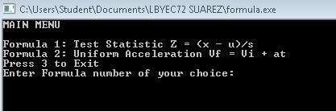
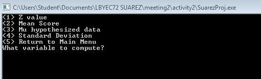
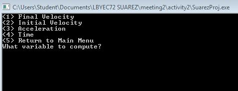
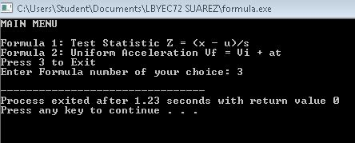
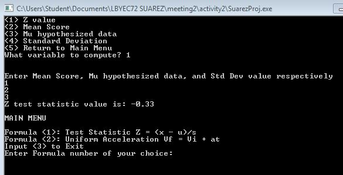
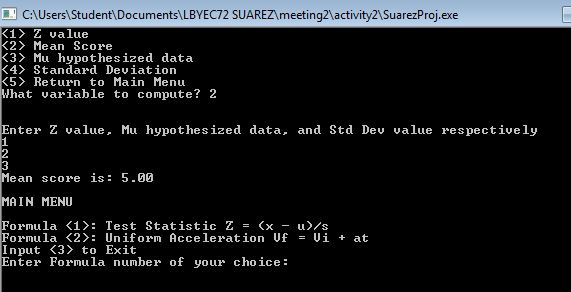
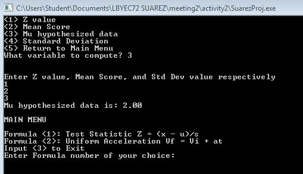
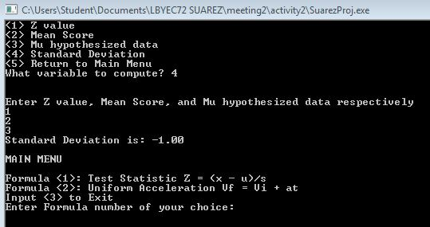
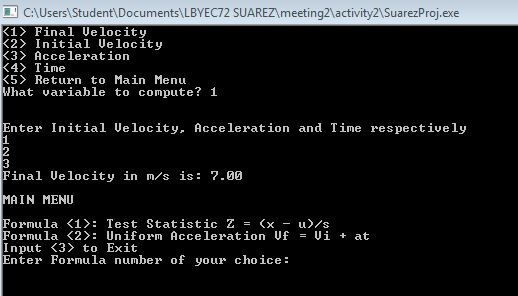
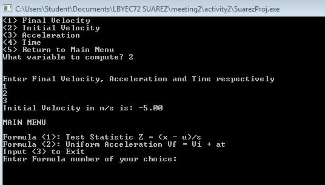
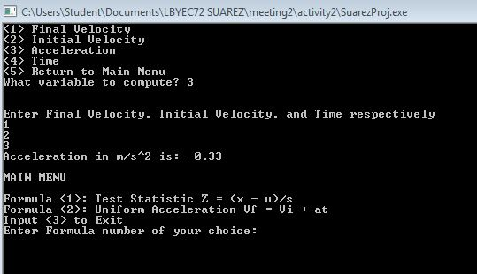
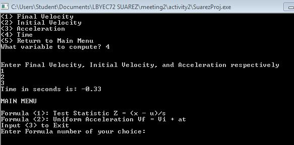
